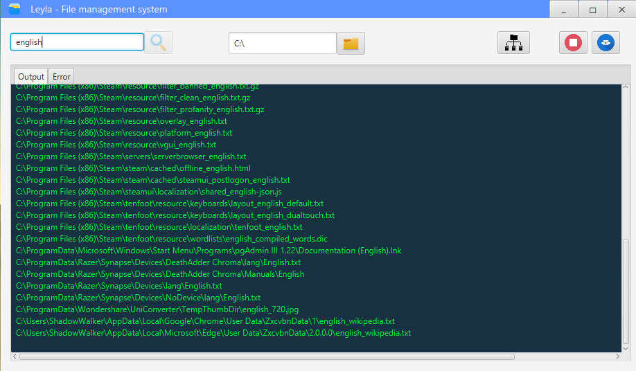

# Leyla

- Feature 1: Search file in current folder.
- Feature 2: Java Watcher service for watching change in current folder file.
- Feature 3: Doubleclick for open any video/image files
- Feature 4: Monitoring changes in directory on/off.(Add/Delete/Edit)

- UI technology: JavaFX
- Usage: copy jar file to folder we want to search or watching change. open and run

